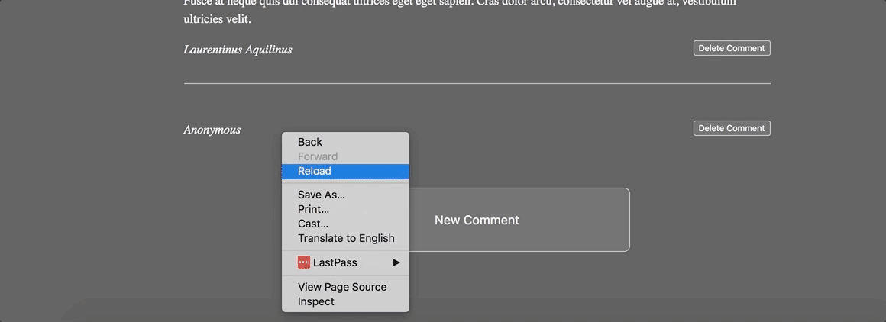

# Behavior Drill: Add Comments


## Summary
We have a webpage that displays an article and a few user comments.  We want users to be able to add new comments, and we're going to write the JavaScript to implement this feature.  The finished product should behave like the page seen in Figure 1.

  
*Figure 1*.  Demonstration of adding comments behaviors.

*Note:* Normally, when users submit comments, we want to persist the data in a database _as well as_ update the UI with JavaScript for an optimal experience. We're going to exclude the requirement that the data be persisted so that we can focus on handling events and updating the DOM.

### Helpful jQuery Resources
This is one of the more complex behavior drills.  There are a few different moving parts we need to coordinate.  We'll rely on the [jQuery][] JavaScript library to help us.

These links should be useful in helping to complete this challenge.

- [jQuery Event Basics][]
- [Handling Events][] (e.g., a form `"submit"` event)
- [event.preventDefault()][] (e.g., to prevent the default form submission behavior)
- [.appendTo()][] / [.append()][]
- [.val()][]

## Releases

### Release 0: Implement Adding Comments

We'll do the vast majority of our work in the JavaScript file `application.js`.  HTML is provided in the file `index.html`; don't modify anything inside the `<body>` tag. CSS is also provided, and should not be modified.  Implement the behavior in Figure 1:

- When the user clicks the *New Comment* button,
  - the button is hidden.
  - the comment form appears.
- When the user submits the form,
  - the data from the form should be added as a comment to the end of the comment list.
  - the form fields should be reset, so that the next comment can be added.
  - the form should be hidden.
  - the *New Comment* button should reappear.

Be sure to follow the specifications and remember to take it slow.  Test the code frequently, make small iterations, and write elegant code.

_Note:_ Don't worry about deleting comments until Release 2.

### Release 1: Handle Empty Form Fields

What happens if a user submits the form without adding any data in the form fields?  We just add empty comments to the comment list.  Let's update the comment-adding behavior to control for missing content:

- Prevent empty comments from appearing in the comment list.  When a user submits the form, only append the new comment if the user has entered some text into the form's text area.
- Allow anonymous comments.  If a user submits the form without providing a name, attribute the comment to *Anonymous*.

### Release 2: Deleting Comments

The "Delete Comment" button is currently not functional. It'll be up to you to make it work.

When a "Delete Comment" button is clicked, that comment should be removed from the DOM (thus removing it from the page).

The "Delete Comment" button needs to work both for the existing comments, as well as any comments we add via our comment form in the future. Be sure to test both.

You may want to revist the jQuery page about [Handling Events][], including the section on binding elements that will be rendered in the future.

### Release 3: Sanitizing input

Yay! The comment section works and is ready for real users. After the release goes out, we received a report saying that if a comment is enclosed in &lt;angle brackets&gt;, then the comment seems to disappear. Can you type &lt;awesome /&gt; into the comment field and hit submit?

Once we try this out, we can figure out what is actually going on. A good place to start is with the developer tools. Let's find the comment by pressing ⌘-f, and then searching for `awesome`

  
*Figure 1*.  Demonstration of looking for the awesome tag.

We expected there to be a new comment (as just text), but the string has been interpreted as HTML instead. The browser saw the angle brackets and said "that looks like a new HTML tag", and so it created it. The trouble is, the browser also doesn't know what to do with an `<awesome>` tag. It doesn't have a rule for `awesome` like it does for `<em>` to create emphasis or `<strong>` to create important content.

What are some other unexpected behaviors a user could cause given that their input is treated as HTML? Try inserting other tags into the comment field (such as `<h1>big comment</h1>`.

This is not only annoying, but it also a possible security vulnerability. What happens when you try to add the following comment to the site? (Feel free to copy and paste)

`<script type="text/javascript">alert("A malicious user can execute JavaScript through this form")</script>`

This is an example of an [injection attack](https://www.owasp.org/index.php/Injection_Theory). It's very similar to the SQL injection attack you learned about in phase 1. If you remember, our SQL code looked something like `SELECT * from Users where id = #{user_id}`. By using string interpolation, the database didn't know the difference between the sql command and the data from the user.

Similarly, for JavaScript, when we have code that looks like this:

```
var comment = $('#comment_text').val();
$('#new_comment_form').html("<li class='comment'><article><p>" + comment + "</p></article>");
```

We are taking user input (in this case stored as comment), using string interpolation, and then passing that to the [$.html()](https://api.jquery.com/html/) function. `.html()` interprets the _entire_ string as HTML and doesn't know that _parts_ of the input should be strictly treated as plain text.

This type of injection attack is something called a [Cross-site-scripting (XSS) attack](https://excess-xss.com/). One way to solve this is to use the [$.text()](https://api.jquery.com/text/) method. When you use `$.text()` it is saying to treat whatever is passed in as plain text, not HTML. The [excess-xss](https://excess-xss.com/#xss-prevention) site has information on strategies for preventing XSS and there's also a cheat sheet [here](https://www.owasp.org/index.php/XSS_%28Cross_Site_Scripting%29_Prevention_Cheat_Sheet), for future reference.

To pass this release, modify the website to prevent HTML injection attacks.

## Conclusion
Handling events and manipulating the DOM are crucial JavaScript skills.  Are we confident in our understanding of how to listen for events?  What about how to handle events?  How to pull data from the DOM?  How to update the DOM?  Be sure to get clarity around these issues. Do not be afraid to ask for help from peers or teachers. This is a critical juncture.


[.append()]: http://api.jquery.com/append/
[.appendTo()]: http://api.jquery.com/appendTo/
[.val()]: http://api.jquery.com/val/
[event.preventDefault()]: http://api.jquery.com/event.preventDefault/
[Handling Events]: http://learn.jquery.com/events/handling-events/
[jquery]: https://jquery.com/
[jQuery Event Basics]: http://learn.jquery.com/events/event-basics/
