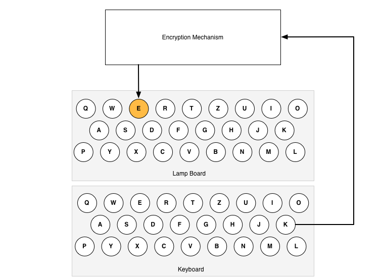
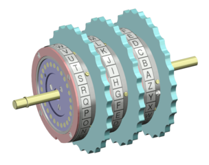
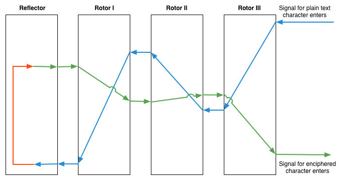

# A Functional Engima

In this challenge you'll be implementing a simulation of the Enigma Machine.

The Enigma was a cipher machine used by Germany in WWII. It was designed to automatically encipher the text of a message, producing an encrypted version of that text for secure transmission over radio. Encrypting the contents of their messages meant the Germans could communicate rapidly across long distances without being concerned about interception. At the time, the machine represented one of the most complex encryption techniques the world had ever seen.

## How it worked

### Input/Output
The Enigma was compact in size, and resembled a mechanical typewriter. Input to the Enigma machine came via keyboard. Above the keyboard, an array of 26 letters with lamps behind them represented the output of the machine. Each keypress would light one of these letters indicating the enciphered letter. An operator would thus encode a message letter-by-letter.

### Rotors
Internally, the Enigma was comprised of **Rotors** and a **Reflector**.

#### Rotor Details

A given rotor had 26 positions, one for each letter of the alphabet. A signal entered one side of the rotor and got routed, internally, to a different position on the other side of the rotor.

The scrambled alphabet in each rotor was _fixed_. In other words, the alphabets were really a series of constants. Below is the scrambled alphabet of the first 3 military rotors:

Rotor | Alphabet (A-Z)
------|----------------------------
 I    | EKMFLGDQVZNTOWYHXUSPAIBRCJ
 II   | AJDKSIRUXBLHWTMCQGZNPYFVOE
 III  | BDFHJLCPRTXVZNYEIWGAKMUSQO

#### Rotors in Series

The first version of the Enigma connected three rotors in series. A signal would enter from the right side (entering the right-most rotor.)  Each rotor would internally transpose the signal position, then the signal would exit into the next rotor.

When the signal exited the left-most rotor, it would reach a _reflector_. The reflector would transpose the letter one last time, and bounce it back through the three rotors before it exited and lit up a lamp representing the enciphered character.

Reflectors were also constant:

Reflector   | Alphabet (A-Z)
------------|---------------------------
A           | EJMZALYXVBWFCRQUONTSPIKHGD
B           | YRUHQSLDPXNGOKMIEBFZCWVJAT
C           | FVPJIAOYEDRZXWGCTKUQSBNMHL

#### Rotation, or "Stepping"

Had the design of the Enigma ended here, the machine would be a simple transposition cipher, in other words, "E" might always map to "Q". Basic transposition ciphers are vulnerable to [frequency analysis](http://en.wikipedia.org/wiki/Frequency_analysis) and would have been an easy target had the Enigma engineers not implemented the _rotation_ of these rotors.

While an operator typed, Enigma rotors would step at different intervals, changing the scrambling process. This meant that the letter "E" might map to "Q" the first time, but later map to a completely different letter. In other words, the path of a given letter through the scrambling process changed every time a character was entered. This made the Enigma a _[polyalphabetic](http://en.wikipedia.org/wiki/Polyalphabetic_cipher)_ transposition cipher. Such a cipher is significantly harder to crack, and outside the scope of something a human could do by hand.

To accomplish the stepping, each rotor had a turn-over position, or "**notch**". The notch would be at _one_ of the positions in the 26 positions on the rotor. When this position was reached in a given rotor, it would cause the rotor to its left to advance by one position. The following is a table of these notch positions:

Rotor | Notch | Result
------|-------|-------
I     | Q     | When rotor steps from Q to R, the next rotor advances
II    | E     | When rotor steps from E to F, the next rotor advances
III   | V     | When rotor steps from V to Q, the next rotor advances

#### Rotation Rules

Rotation followed the following rules:

  * Rotation of the rotors occurred _before_ the signal entered the encryption mechanism. Rotation first, signal processing second.
  * The rotor in the right-most position rotated with _every keypress_
  * The rotor in the middle position rotated when the right rotor passed its notch
  * The rotor in the left position rotated with the middle rotor passed its notch

##### The Double Step

In truth, the rotation scheme outlined above would be little more than a base-26 "odometer", but the Enigma had a design quirk that made it a little more complicated. The middle rotor had an additional rule.

The middle rotor rotates if the right rotor has reached its notch, **or** if the middle rotor has reached its own notch. This means that the middle rotor may "double-step", moving because of the right rotor on one keypress, and then moving because the middle rotor has reached its own notch on the next.

The double step is hard to explain. We'll be using a paper simulation to step through the workings of the Enigma before we begin, and it will be easier to explain then.

### Encryption Keys

The encryption "key" for an Enigma was made up of the following:
 * The Reflector (A, B or C)
 * The Rotors (I-V, we will only work with I-III)
 * The order of the Rotors
 * The initial position of each Rotor

### The Plug Board

We will not be emulating the Enigma plug board.

### In Action

You can watch [this video](https://www.youtube.com/watch?v=ASfAPOiq_eQ&t=125) of an Enigma in action.

## Arts and Crafts Time

Print this [paper Enigma simulation](assets/paper-enigma.pdf) (credit to [Mike Koss](http://mckoss.com/Crypto/Enigma.htm)) and set it up per the instructions. You'll need scissors or a knife to cut out space for the rotors.

Follow the example by hand with the paper enigma. Don't start coding until you can successfully emulate the Enigma's encipherment process with the paper version.

Don't suffer in silence, make sure you ask for help if you get stuck.

## Simulator

[Enigma Simulator](https://web.archive.org/web/20160408061911/http://startpad.googlecode.com/hg/labs/js/enigma/enigma-sim.html)

Test your code and paper process against the simulator. It will also be handy to test double-stepping when it comes time.

## You do have to write code, you know.

If you're feeling comfortable with the paper version, it's time to start coding. Go [implement the Enigma in Racket](challenge.md). I'm sure it'll be a cinch.

## Resources

 * [Wikipedia: Overview of the Enigma](http://en.wikipedia.org/wiki/Enigma_machine)
 * [Wikipedia: Enigma Rotor Details](http://en.wikipedia.org/wiki/Enigma_rotor_details)
 * [Visual Explanation of the Enigma](http://www.theguardian.com/technology/2014/nov/14/how-did-enigma-machine-work-imitation-game)
 * [Another Enigma Overview](http://www.codesandciphers.org.uk/enigma/enigma1.htm)
   * [Enigma Overview Example](http://www.codesandciphers.org.uk/enigma/example1.htm)
   * [Enigma Overview Rotors Explanation](http://www.codesandciphers.org.uk/enigma/enigma2.htm)
