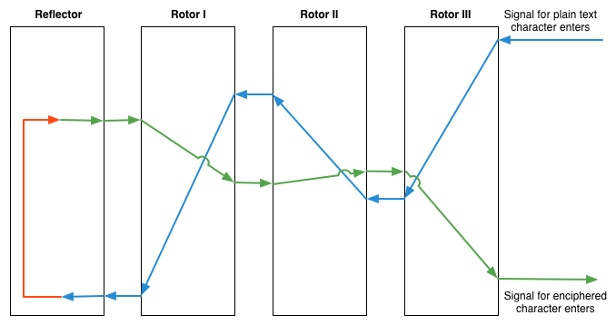

# Implementing the Enigma

You will be simulating the Enigma machine in this challenge. Ultimately, you should have a single function that can encipher and decipher text given the rotors, the rotor order, the rotor offsets, and the reflector.

Of course, you shouldn't _just_ have one function. Your final solution will no doubt be a composition of many functions that work together to accomplish your goal.

## Alpha
Let's be honest, this is a complex mechanism we're trying to build. This challenge is in "alpha" and there will be bugs, points of confusion, and outright lies.

## Restrictions
Any iteration you do will need to be performed with recursion, or with higher-order functions that operate on lists (like map).
- The only _data structure_ available to you is the list. You won't be taking advantage of any other data structures Racket offers you. For example, no hashes or structs
- The data structure restriction is not a _type_ restriction. You will undoubtedly be working with different (non-data structure) types as well: char, boolean, number, string, etc.

## Tips
- Make lots of functions that do a small piece of work well
- Compose more complicated functions from multiple small ones
- Write out your contracts to keep track of the inputs and output of your functions as you write them
- Don't forget higher order functions like map, curry, filter, etc.
- The [Racket Docs](http://docs.racket-lang.org/reference/pairs.html) are actually pretty good
- Use the REPL to play around
- Ask questions

## Checking your work
Use [this online simulation](http://startpad.googlecode.com/hg/labs/js/enigma/enigma-sim.html) of the Enigma to check your results as you go.

## Reference Information

### Rotors

Rotor | Alphabet (A-Z)
------|----------------------------
 I    | EKMFLGDQVZNTOWYHXUSPAIBRCJ
 II   | AJDKSIRUXBLHWTMCQGZNPYFVOE
 III  | BDFHJLCPRTXVZNYEIWGAKMUSQO

### Rotor notches

Rotor | Notch | Result
------|-------|-------
I     | Q     | When rotor steps from Q to R, the next rotor advances
II    | E     | When rotor steps from E to F, the next rotor advances
III   | V     | When rotor steps from V to Q, the next rotor advances

### Reflectors

Reflector   | Alphabet (A-Z)
------------|---------------------------
A           | EJMZALYXVBWFCRQUONTSPIKHGD
B           | YRUHQSLDPXNGOKMIEBFZCWVJAT
C           | FVPJIAOYEDRZXWGCTKUQSBNMHL

## Release 1, Static Single Rotor

Enough talking, let's get started.

For your first release, model a rotor. You should be able to translate a "signal" entering one side of the rotor to a different position exiting the rotor.


In this release, and the next few that follow it, you're only worrying about translating a single character.

## Release 2, Rotating Single Rotor

Like the paper Enigma you played with, you should be able to rotate the rotor to a start position, also known as the "ground" setting. Here is Rotor I rotated to "D".


However you accomplished translating a signal through the rotor in Release 1 should still work with a rotated rotor.

## Release 3, Chaining Rotors

Model a chain of three rotors in sequence. A signal should enter the right-most rotor and translate through all three in sequence, exiting at some position 0-25 based on the scrambling process.

You should be able to order the rotors, and specify the ground (initial rotation) of each rotor.

## Release 4, Reflector

Model a reflector that "reflects back" the signal that moves through the three rotors in sequence. Given an input to the right-most rotor, the "signal" should move through each rotor, reflect, and return, exiting the right-most rotor at a different position.



## Release 5, Stepping

Now we're going to work with multiple characters in sequence. To do this you need to implement "stepping".

First, remember that stepping happens _first_, then the signal enters the rotors sequence.

The right-most rotor steps once for every keypress.

The middle rotor steps once the right-rotor steps past the right rotor's notch. The middle rotor _also_ steps if it has reached its own notch.

The left-most rotor steps if the middle rotor reaches its notch.

## Release 6, Altogether Now

If you have all of the pieces assembled, you should now be able to encrypt and decrypt messages. Try the following test cases:

```
Reflector: B
Rotors: I II III
Ground: MCK
"Enigma" -> "QMDGDO"

Reflector: B
Rotors: I II III
Ground: MAU
"Enigma" -> "IFAMZT"

Reflector: B
Rotors: I II III
Ground: KDV
"Enigma" -> "HGXEDI"
```

## Did you make it this far?
Way to go. Seriously. Take a break, kick your feet up, drink some Ovaltine. You deserve it.
