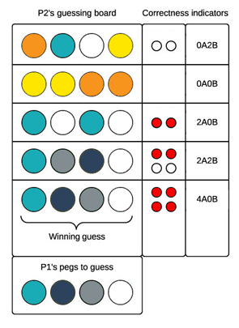

# Mastermind

## Summary
Build a command-line version of the classic puzzle game [Mastermind](https://en.wikipedia.org/wiki/Mastermind_(board_game)) (otherwise known as [Bulls and Cows](https://en.wikipedia.org/wiki/Bulls_and_cows)).

### Gameplay
One player, the code maker, selects four colored pegs and creates a code (e.g., teal, blue, gray, and white; see Figure 1). The pegs come in six colors and colors can be repeated.  Once the code is created, the codebreaker tries to guess the code: the correct colors in the correct sequence.

The codebreaker has 12 chances to correctly guess the code. After each incorrect guess, the code maker provides two pieces of information to the codebreaker: (1) the number of pegs of the right color in the right position and (2) the number of pegs of the right color but in the wrong position.

The codebreaker wins if the code is correctly guessed within 12 guesses. The code maker wins if the codebreaker does not correctly guess the code.

### Code Maker and Codebreaker Roles
In our application, the computer will assume the role of the code maker. Users will take on the role of the codebreaker. When the application begins, the computer will create a code. Users will have 12 attempts to guess the code. The computer will need to provide feedback to the user after each incorrect guess.

### Communicating Feedback on Guesses
After each incorrect guess, the codebreaker receives feedback on how close the guess is to the actual code. In Figure 1, we see two methods of providing this feedback (i.e., the correctness indicators). First are *key pegs*.  Colored key pegs (red in Figure 1) indicate that a guessed peg is the correct color and in the correct position; white key pegs indicate that a guessed peg is the correct color but in the wrong position. The second method is a string like *0A2B*; this particular string indicates that zero guessed pegs are the correct color and in the correct position (*0A*) and that two guessed pegs are the correct color but in the wrong position (*2B*). In our application, we can use either of these methods or another method.

*Figure 1*.  Example Mastermind board with feedback on incorrect guesses provided.

## Releases
### Pre-release: Design the System
Using a whiteboard or piece of paper, model the various components of the game (see Figure 2 for an example implementation). How might we represent the board, the code, the guesses, the pegs, etc.? What types of objects will we need? What behaviors will the objects need? What types of relationships will exist between the objects? How will the objects interface with each other?

![game play animation][]
*Figure 2*.  Example game implementation.

### Release 0: Build the Application
Following our design from the *Pre-release* section, implement the gameplay as described in the *Summary*. Figure 2 provides an example implementation, which we may choose to emulate or not; just be sure that users' previous guesses and feedback are visible when making the next guess. Of course, if anything is missing from our design or we find better alternatives, we are free to modify our design. Ensure that the objects' behaviors are tested.

### Release 1: Refactor
Refactor our code. Apply the concepts from Practical Object-oriented Design in Ruby, specifically Chapters 2 - 4. Questions we might ask ourselves:

- Is the code DRY?
- Are the methods and variables appropriately named?
- Are the chosen data structures appropriate?
- Is the code concise and comprehensible?
- Do each of the classes and methods have a single responsibility?
- Is each responsibility assigned to an appropriate object (i.e., which object's job is it to perform which behaviors)?

### Release 3: Add Features *(optional)*
This is an optional release. Add a feature or two to the game. Some suggestions:

- Allow a second user to replace the computer as the code maker.
- Allow two users to play head-to-head for a specified number of rounds, alternating the code maker and codebreaker roles. Develop a scoring system or follow the official system: the code maker gets one point for each guess made by the codebreaker.
- Keep stats. Record usernames and outcomes for each game played (e.g., in a CSV file). Who breaks codes in the least number of guesses?  Whose codes are most difficult to break?
- Allow the user to adjust the difficulty level (e.g., fewer or more color options, shorter or longer codes, fewer or more guesses).
- Implement a code-breaking algorithm.

[code-breaking algorithm]: http://mathworld.wolfram.com/Mastermind.html
[game play animation]: readme-assets/mastermind-animation.gif
